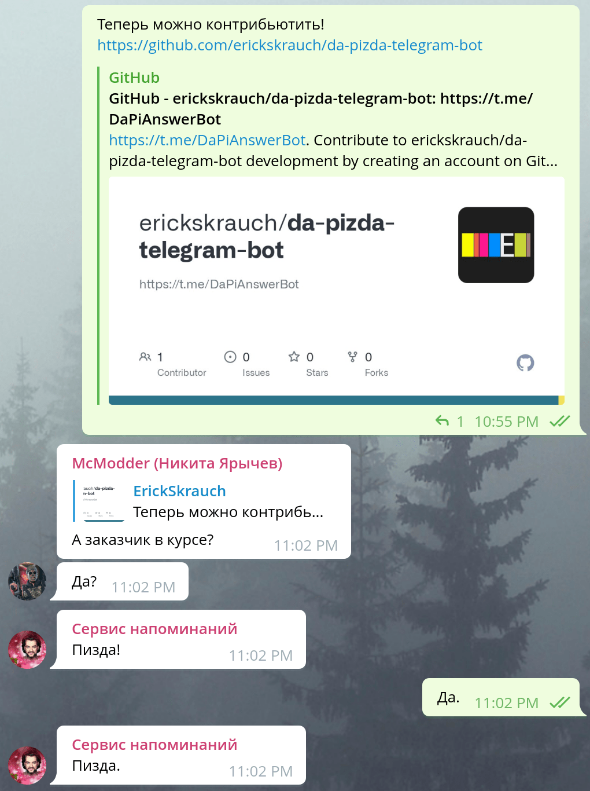

> *8 лет профессионального опыта разработки привели меня сюда...*

# Да-Пизда бот для Telegram

  
Шутка, которая зашла слишком далеко

  > **X**: Эрик) знаешь такую шутку
  >
  > **X**:
  > Да
  > 
  > Пизда
  >
  > **ErickSkrauch**: X? xD
  >
  > **X**: Я просто заебался после слов да людям отвечать пизда)
  >
  > **X**: Хочу бот такой написать) добавляешь в чат
  >
  > **X**: И после каждого да бот автоматом пишет пизда))
  >
  > **ErickSkrauch**: Звучит как стартап на миллион xD

Если вы сталкивались с подобной проблемой, то [этот бот](https://t.me/DaPiAnswerBot) определённо готов вам помочь. Просто добавьте его в свою любимую группу в Telegram и наслаждайтесь.

Бот обучен некоторым особым приёмам и распознаёт простые методы обхода. Если у вас есть идеи, как его улучшить ещё больше, то, пожалуйста, [создайте issue](https://github.com/erickskrauch/da-pizda-telegram-bot/issues/new).
